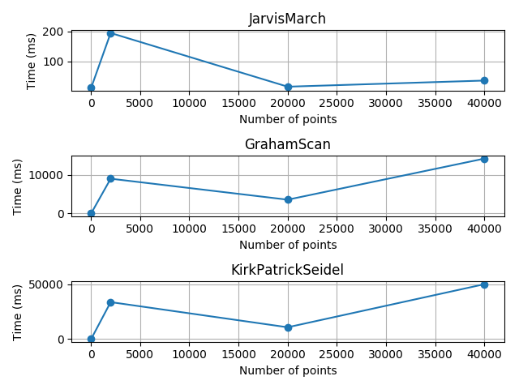

# Analysis of Convex Hull Algorithms

Given below are plots for the three algorithms.
The benchmarks are given in the `benchmarks` folder and have been computed with the help of the C++ benchmark library Hayai. for better accuracy.

## Comments
**It is important to point out that `2000` point case is actually a 5000 point case, the displacement is a mistake in the plots.**
It was suprising to see the severe difference in running time between the 5000 points case and the 20000 case. Much of this discrepancy happens due to the point distribution of the two cases. While the 5000 case consisted of a distribution of random points in a bounded box, the 20000 and 40000 cases both consisted of points with x being ascending and y being random.

## Average Case

## Worst Case

## Best Case

